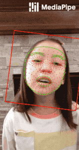
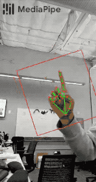
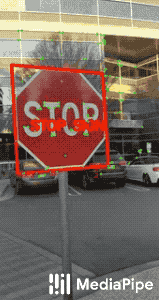

 \
Google's MediaPipe: https://github.com/google/mediapipe 

# Fork of Google's MediaPipe (v0.8.9) for Jetson Nano (JetPack 4.6) CUDA (10.2)
*   Currently hand landmarks detection and selfie segmentation only!
--------------------------------------------------------------------------------
This repo represents fixes and instructions needed to sucessfully build latest MediaPipe for Jetson Nano with CUDA support.
It additionally provides python wheel (aarch64) for immediate installation.

## Compile from source (for new versions)
Instructions are inspired by **[PINTO0309's](https://github.com/PINTO0309)** notes avaliable at **[Verification of mediapipe's GPU-enabled .pbtxt processing method](https://zenn.dev/pinto0309/scraps/71368ef3d74438)**.
...Work In Progres...

```bash
### Do not forget set g++8:
$ sudo update-alternatives --config g++

### Build: 
$ pip3 uninstall -y mediapipe && sudo python3 setup.py gen_protos && sudo python3 setup.py bdist_wheel && python3 -m pip install dist/mediapipe-0.8.9_cuda102-cp36-cp36m-linux_aarch64.whl
```

## Installation (for clean Jetpack 4.6 - 4.6.1) - Python Wheel
Binary (v0.8.9) is available in https://github.com/anion0278/mediapipe-jetson/tree/master/dist. 
```bash
### Preparing pip
$ sudo apt update
$ sudo apt install python3-pip
$ pip3 install --upgrade pip
### Remove previous versions of Mediapipe (if it was installed):
$ pip3 uninstall mediapipe
### Install from wheel with (run commands from mediapipe dir):
$ pip3 install protobuf==3.19.4 opencv-python dataclasses mediapipe-0.8.9_cuda102-cp36-linux_aarch64.whl
### Note: Building wheel for opencv-python may take quite some time (up to few hours)!
```

## Running examples - notes
Please note, that official selfie segmentation example from https://google.github.io/mediapipe/solutions/selfie_segmentation.html requires changes in order to make it work: 
```python
### skip 3rd dimension in resulting mask
output_image = np.where(condition[:,:,0,:], fg_image, bg_image)
### and the same for video input example
output_image = np.where(condition[:,:,0,:], image, bg_image)
```

## Acknowledgement
Inspired by **[jiuqiant's](https://github.com/jiuqiant)** **[mediapipe_python_aarch64](https://github.com/jiuqiant/mediapipe_python_aarch64)** and **[PINTO0309's](https://github.com/PINTO0309)** **[mediapipe-bin](https://github.com/PINTO0309/mediapipe-bin)**. You are awesome guys!

--------------------------------------------------------------------------------

## Live ML anywhere

[MediaPipe](https://google.github.io/mediapipe/) offers cross-platform, customizable
ML solutions for live and streaming media.

                                                               | 
:------------------------------------------------------------------------------------------------------------: | :----------------------------------------------------:
***End-to-End acceleration***: *Built-in fast ML inference and processing accelerated even on common hardware* | ***Build once, deploy anywhere***: *Unified solution works across Android, iOS, desktop/cloud, web and IoT*
                                                             | 
***Ready-to-use solutions***: *Cutting-edge ML solutions demonstrating full power of the framework*            | ***Free and open source***: *Framework and solutions both under Apache 2.0, fully extensible and customizable*

## ML solutions in MediaPipe

Face Detection                                                                                                                 | Face Mesh                                                                                                       | Iris                                                                                                      | Hands                                                                                                      | Pose                                                                                                      | Holistic
:----------------------------------------------------------------------------------------------------------------------------: | :-------------------------------------------------------------------------------------------------------------: | :-------------------------------------------------------------------------------------------------------: | :--------------------------------------------------------------------------------------------------------: | :-------------------------------------------------------------------------------------------------------: | :------:
[](https://google.github.io/mediapipe/solutions/face_detection) | [](https://google.github.io/mediapipe/solutions/face_mesh) | [](https://google.github.io/mediapipe/solutions/iris) | [](https://google.github.io/mediapipe/solutions/hands) | [](https://google.github.io/mediapipe/solutions/pose) | [](https://google.github.io/mediapipe/solutions/holistic)

Hair Segmentation                                                                                                                       | Object Detection                                                                                                                     | Box Tracking                                                                                                                | Instant Motion Tracking                                                                                                                               | Objectron                                                                                                             | KNIFT
:-------------------------------------------------------------------------------------------------------------------------------------: | :----------------------------------------------------------------------------------------------------------------------------------: | :-------------------------------------------------------------------------------------------------------------------------: | :---------------------------------------------------------------------------------------------------------------------------------------------------: | :-------------------------------------------------------------------------------------------------------------------: | :---:
[](https://google.github.io/mediapipe/solutions/hair_segmentation) | [](https://google.github.io/mediapipe/solutions/object_detection) | [](https://google.github.io/mediapipe/solutions/box_tracking) | [](https://google.github.io/mediapipe/solutions/instant_motion_tracking) | [](https://google.github.io/mediapipe/solutions/objectron) | [](https://google.github.io/mediapipe/solutions/knift)

<!-- []() in the first cell is needed to preserve table formatting in GitHub Pages. -->
<!-- Whenever this table is updated, paste a copy to solutions/solutions.md. -->

[]()                                                                                      | [Android](https://google.github.io/mediapipe/getting_started/android) | [iOS](https://google.github.io/mediapipe/getting_started/ios) | [C++](https://google.github.io/mediapipe/getting_started/cpp) | [Python](https://google.github.io/mediapipe/getting_started/python) | [JS](https://google.github.io/mediapipe/getting_started/javascript) | [Coral](https://github.com/google/mediapipe/tree/master/mediapipe/examples/coral/README.md)
:---------------------------------------------------------------------------------------- | :-------------------------------------------------------------: | :-----------------------------------------------------: | :-----------------------------------------------------: | :-----------------------------------------------------------: | :-----------------------------------------------------------: | :--------------------------------------------------------------------:
[Face Detection](https://google.github.io/mediapipe/solutions/face_detection)                   | ✅                                                               | ✅                                                       | ✅                                                       | ✅                                                             | ✅                                                             | ✅
[Face Mesh](https://google.github.io/mediapipe/solutions/face_mesh)                             | ✅                                                               | ✅                                                       | ✅                                                       | ✅                                                             | ✅                                                             |
[Iris](https://google.github.io/mediapipe/solutions/iris)                                       | ✅                                                               | ✅                                                       | ✅                                                       |                                                               |                                                               |
[Hands](https://google.github.io/mediapipe/solutions/hands)                                     | ✅                                                               | ✅                                                       | ✅                                                       | ✅                                                             | ✅                                                             |
[Pose](https://google.github.io/mediapipe/solutions/pose)                                       | ✅                                                               | ✅                                                       | ✅                                                       | ✅                                                             | ✅                                                             |
[Holistic](https://google.github.io/mediapipe/solutions/holistic)                               | ✅                                                               | ✅                                                       | ✅                                                       | ✅                                                             | ✅                                                             |
[Selfie Segmentation](https://google.github.io/mediapipe/solutions/selfie_segmentation)         | ✅                                                               | ✅                                                       | ✅                                                       | ✅                                                             | ✅                                                             |
[Hair Segmentation](https://google.github.io/mediapipe/solutions/hair_segmentation)             | ✅                                                               |                                                         | ✅                                                       |                                                               |                                                               |
[Object Detection](https://google.github.io/mediapipe/solutions/object_detection)               | ✅                                                               | ✅                                                       | ✅                                                       |                                                               |                                                               | ✅
[Box Tracking](https://google.github.io/mediapipe/solutions/box_tracking)                       | ✅                                                               | ✅                                                       | ✅                                                       |                                                               |                                                               |
[Instant Motion Tracking](https://google.github.io/mediapipe/solutions/instant_motion_tracking) | ✅                                                               |                                                         |                                                         |                                                               |                                                               |
[Objectron](https://google.github.io/mediapipe/solutions/objectron)                             | ✅                                                               |                                                         | ✅                                                       | ✅                                                             | ✅                                                             |
[KNIFT](https://google.github.io/mediapipe/solutions/knift)                                     | ✅                                                               |                                                         |                                                         |                                                               |                                                               |
[AutoFlip](https://google.github.io/mediapipe/solutions/autoflip)                               |                                                                 |                                                         | ✅                                                       |                                                               |                                                               |
[MediaSequence](https://google.github.io/mediapipe/solutions/media_sequence)                    |                                                                 |                                                         | ✅                                                       |                                                               |                                                               |
[YouTube 8M](https://google.github.io/mediapipe/solutions/youtube_8m)                           |                                                                 |                                                         | ✅                                                       |                                                               |                                                               |

See also
[MediaPipe Models and Model Cards](https://google.github.io/mediapipe/solutions/models)
for ML models released in MediaPipe.

## Getting started

To start using MediaPipe
[solutions](https://google.github.io/mediapipe/solutions/solutions) with only a few
lines code, see example code and demos in
[MediaPipe in Python](https://google.github.io/mediapipe/getting_started/python) and
[MediaPipe in JavaScript](https://google.github.io/mediapipe/getting_started/javascript).

To use MediaPipe in C++, Android and iOS, which allow further customization of
the [solutions](https://google.github.io/mediapipe/solutions/solutions) as well as
building your own, learn how to
[install](https://google.github.io/mediapipe/getting_started/install) MediaPipe and
start building example applications in
[C++](https://google.github.io/mediapipe/getting_started/cpp),
[Android](https://google.github.io/mediapipe/getting_started/android) and
[iOS](https://google.github.io/mediapipe/getting_started/ios).

The source code is hosted in the
[MediaPipe Github repository](https://github.com/google/mediapipe), and you can
run code search using
[Google Open Source Code Search](https://cs.opensource.google/mediapipe/mediapipe).
